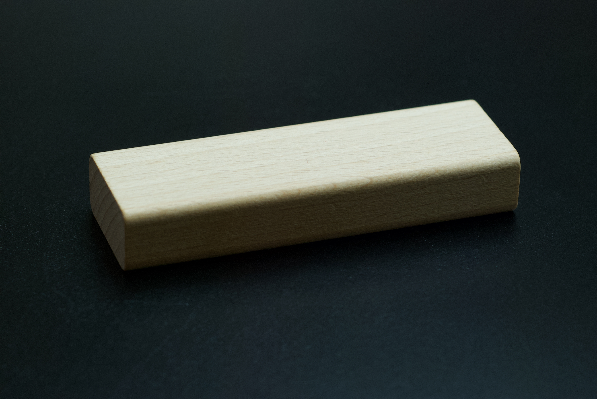

{ class=hero-image }

# Soundmining

Soundmining makes dark, generative ambient music. Based both on pure electronic sounds and recorded natural sounds.

Behind Soundmining is a Swedish composer named Daniel Ståhl. Born in Stockholm, Sweden 1967 and is currently based in Stockholm. 
Studied composition at the Royal College of Music in Stockholm between 1992 and 1995.

Here I write about music. Both my own and in general.

## Links

[SoundCloud](https://soundcloud.com/danielstahl) · 
[Bandcamp](https://soundmining.bandcamp.com) · 
[Spotify](https://open.spotify.com/artist/1JCdKZdnXmyIKR2q9YtrHG) ·
[YouTube](https://youtube.com/@soundmining7172)

