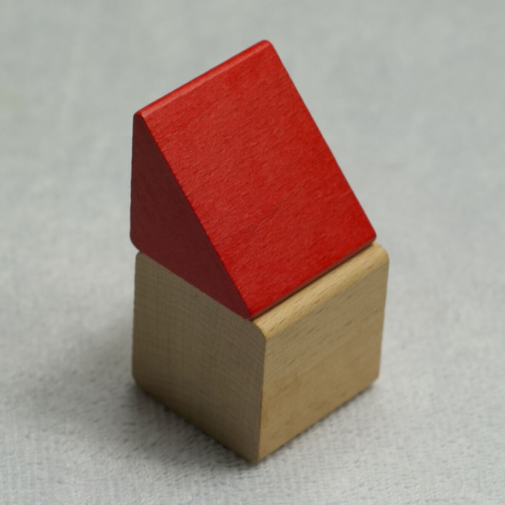

{ class=coverart-image }

# Heart and flow
This is the eighth in a series of Ambient Music pieces. It is based on a single guitar strumming. 
The source-code can be found at [github.com/danielstahl/soundmining-monorepo/tree/main/projects/ambient-music-8](https://github.com/danielstahl/soundmining-monorepo/tree/main/projects/ambient-music-8)

## SoundCloud

<iframe width="100%" height="166" scrolling="no" frameborder="no" allow="autoplay; encrypted-media" src="https://w.soundcloud.com/player/?url=https%3A//api.soundcloud.com/tracks/soundcloud%253Atracks%253A1697266059&color=%23cdcdcc&auto_play=false&hide_related=false&show_comments=true&show_user=true&show_reposts=false&show_teaser=true"></iframe>
<a href="https://soundcloud.com/danielstahl" title="soundmining" target="_blank" style="color: #cccccc; text-decoration: none;">soundmining</a> · <a href="https://soundcloud.com/danielstahl/scream-in-the-desert" title="Scream in the desert" target="_blank" style="color: #cccccc; text-decoration: none;">Scream in the desert</a>

## Bandcamp

<iframe style="border: 0; width: 100%; height: 120px;" src="https://bandcamp.com/EmbeddedPlayer/track=2506468475/size=large/bgcol=ffffff/linkcol=0687f5/tracklist=false/artwork=small/transparent=true/" seamless><a href="https://soundmining.bandcamp.com/track/scream-in-the-desert">null by Soundmining</a></iframe>